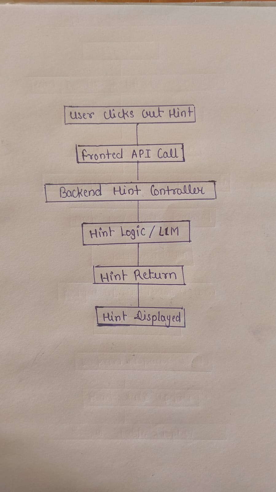

# CipherSQLStudio-Assignment
SQL practice platform with real-time query execution

# CipherSQLStudio

CipherSQLStudio is a browser-based SQL learning platform where students can practice SQL queries against pre-configured assignments.

Users can select an assignment, write SQL queries in an editor, execute them in real time, and view results directly in the browser.

## 🚀 Features

* SQL Assignment Listing Page
* Assignment Attempt Interface
* Monaco SQL Code Editor
* Execute SQL Queries in Real-Time
* Result Table Viewer
* Sample Data Viewer
* Hint System
* Responsive UI

## 🛠 Tech Stack

Frontend

* React.js
* SCSS
* Monaco Editor

Backend

* Node.js
* Express.js

Database

* PostgreSQL (Neon)

## 📂 Project Structure

CipherSQLStudio
│
├── frontend
│   ├── components
│   ├── pages
│   ├── styles
│   └── App.jsx
│
├── backend
│   ├── controllers
│   ├── routes
│   ├── config
│   └── server.js
│
└── README.md

## ⚙️ Installation

### 1️⃣ Clone Repository

git clone https://github.com/Bhanubasyan/CipherSQLStudio-Assignment.git

cd CipherSQLStudio

### 2️⃣ Install Dependencies

Backend

cd backend
npm install

Frontend

cd frontend
npm install

### 3️⃣ Setup Environment Variables

Create .env file in backend:

DATABASE_URL=your postgresql connection string

### 4️⃣ Run Application

Backend

node server.js

Frontend

npm start

## Query Flow Diagram

## Hint Flow Diagram

## 📊 Example SQL Queries

SELECT * FROM employees;

SELECT MAX(salary) FROM employees;

SELECT department, COUNT(*)
FROM employees
GROUP BY department;

## 🎯 Learning Goals

* Practice SQL queries
* Understand database querying
* Learn query filtering, grouping, and aggregation

## 📜 License

This project is for educational purposes.
